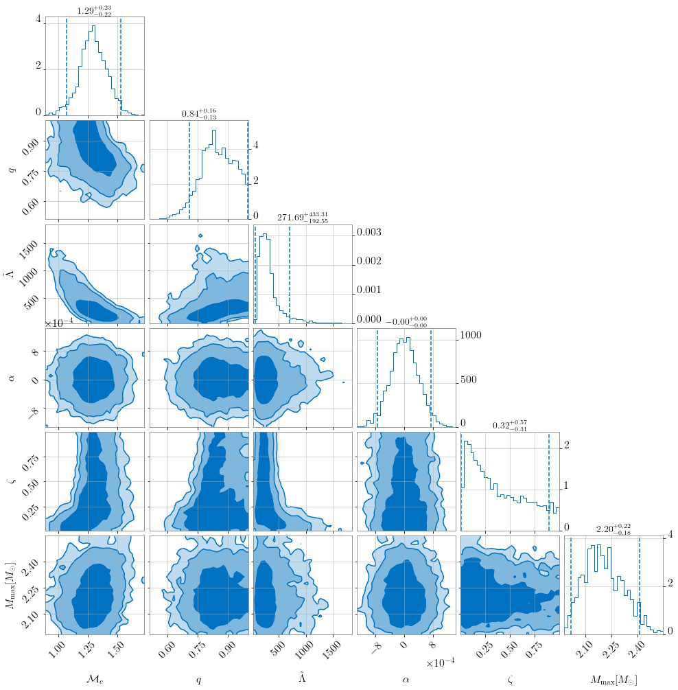

## Connecting Electromagnetic signals to Binary Source Properties 

In NMMA, it is possible to use the results from GW inferences together with kilonova inferences or joint KN+GRB afterglow inferences to get estimates on the binary properties. 
A binary system can be a binary neutron star (BNS) merger or a neutron-star-black-hole (NSBH) merger. We can connect observed electromagnetic signals to potential 
source properties via phenomenological relations, i.e., via fits based on numerical-relativity relations, see [(Pang et al. 2022)](https://arxiv.org/pdf/2205.08513.pdf) and Refs. therein for further details. 

For estimating the source properties, the following input files are required:

* `EMsamples` - is the posterior sample file from a previous Bayesian inference (e.g. Kilonova+GRB inference) on electromagnetic (EM) signals,
* `EMprior` - is the prior file that was used for the EM inference 
* `EOS` - number of equation of state files which will be used in the resampling
* `EOSpath` - path to the folder of all EOS files
* `GWsamples` - some fiducial randomly generated posterior samples for masses $m_{1,2}$ , chirp mass $\mathcal{M}_c$, mass ratio $q$, luminosity distance $D_L$, and EOS samples,
* `GWprior` - a prior file for gravitational wave sources

**Estimating BNS properties**

Here, we take the observed gamma-ray burst [GRB211211A](https://arxiv.org/abs/2204.10864) as an example and assume that associated electromagnetic signals 
originated from a BNS merger. For this signal, a joint inference (kilonova + GRB) can be carried out and will provide you with the required `EMsamples`.
For the `GWsamples` input file, we need to generate some fiducial dummy GW samples. A script for the generation can be found [here](https://github.com/nuclear-multimessenger-astronomy/nmma/blob/main/example_files/tools/gwem_resampling/gwsamples_generation.py).
The GW sample generation is based on the EOS set `15nsat_cse_uniform_R14` which can be found on [Zenodo](https://zenodo.org/record/6106130#.Y1pdM9JBxhG). 
The `EMprior` file is the same as used for the KN+GRB inference (see [priors](https://github.com/nuclear-multimessenger-astronomy/nmma/tree/main/priors)) and the GWprior file should be adjusted to the GWsamples. 

Finally, we can use this command:

    gwem_resampling --outdir outdir --GWsamples example_files/tools/gwem_resampling/GWsamples.dat --GWprior priors/GWBNS.prior --EMsamples example_files/tools/gwem_resampling/GRB211211A_posterior_samples.dat --EOSpath 15nsat_cse_uniform_R14/macro/ --Neos 5000 --EMprior priors/Bu2019lm_TrPi2018GRB211211A.prior --nlive 1024  

The result will be a posterior file containing information on:

* the chirp mass $\mathcal{M}_c$,
* mass ratio $q$,
* Tidal deformability $\tilde{\Lambda}$,
* dynamical ejecta mass error $α$,
* dynamical ejecta mass fraction $ζ$, and
* equation of state EOS

A corner plot is shown below:

**Estimating NSBH properties**

In order to estimate the properties of a NSBH system, you need to adjust the `GWsamples` and `GWprior` file accordingly and run the resampling
with the argument `withNSBH` (otherwise, you will run for a BNS system).

    gwem_resampling --outdir outdir --GWsamples example_files/tools/gwem_resampling/GWsamples_NSBH.dat --GWprior priors/GWNSBH.prior --withNSBH --EMsamples example_files/tools/gwem_resampling/GRB211211A_NSBH_posterior_samples.dat --EOSpath 15nsat_cse_uniform_R14/macro/ --Neos 5000 --EMprior priors/Bu2019nsbh_TrPi2018_GRB211211A.prior --nlive 1024  

